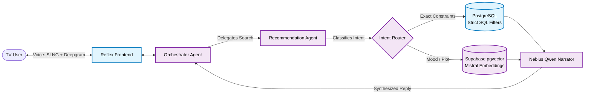

#  Kino Files: HackBarna 2026 Submission

**Find your next favorite film with Kino Files, a conversational agent that listens to your group preferences and filters a real movie catalog to deliver reliable, personalized recommendations.**

Finding the right movie often feels like a chore, and deciding what to watch as a group is even harder—it often requires a "neutral" voice to settle the debate. Traditional recommendation engines rely on rigid genre tags, while generic LLMs hallucinate non-existent titles or recommend films you can't watch. Kino Files solves this by blending the conversational fluidity of LLMs with a strict Retrieval-Augmented Generation (RAG) pipeline to keep all suggestions grounded in reality, acting as the perfect mediator for your movie night.

---

## 🚀 Live Demo

**Try the app here:** [kino-files-agent.thebluetonguegiraffe.online](https://kino-files-agent.thebluetonguegiraffe.online/)  
*(Note: Please allow microphone permissions in your browser to experience the full conversational voice agent).*

---

## Team Members

- [Anna Falceto Pinyol](https://www.linkedin.com/in/anna-falceto-pinyol/)
- [Martí La Rosa Ramos](https://www.linkedin.com/in/martilarosaramos/)
- [Manuel Félix Parma](https://www.linkedin.com/in/manuel-parma/)

---

## 🏗️ Architecture & Implementation

Our entire codebase is housed in the [`kinofiles/`](./kinofiles) directory. Here is a high-level look at how we built the system:

1. **The Vector Database:** We extracted the top 1,000 most popular films from the [Letterboxd Kaggle dataset](https://www.kaggle.com/datasets/gsimonx37/letterboxd), embedded 109 unique movie themes using Mistral, and populated a **Supabase** database with `pgvector` for semantic search.
2. **Multi-Agent Orchestration:** We built a dual-agent system using **LangGraph**. At the top level, the **Orchestrator Agent** acts as a group mediator, asking multiple users for their preferences and conducting voting rounds. It delegates search tasks to the underlying **Recommendation Agent**. This subagent is uniquely capable of analyzing natural language to dynamically route requests to the most appropriate query method: a semantic mood search using `pgvector`, a plot-identification search using description embeddings, a "similar-to" seed search, or bypassing vectors entirely to run strict SQL database filters (e.g., for exact genre/actor constraints).
3. **The Voice Layer:** The backend communicates with a **Reflex** frontend designed for the living room, using **SLNG** to bridge the gap between user voice commands (Deepgram STT) and the agent's spoken responses (Aura-2 TTS).

### Recommendation Agent Capabilities

The Recommendation Agent does not use a "one-size-fits-all" retrieval strategy. By classifying user intent, it executes specific capabilities:
*   **Semantic Mood Search:** ("Something melancholy about family") Embeds the query to find vector neighbors in the `themes_embeddings` table.
*   **Plot Identification:** ("An animated movie about a rat in Paris") Embeds the query to find vector neighbors in the `descriptions_embeddings` table to guess the movie.
*   **Similar-To Search:** ("Like The Dark Knight") Locates the seed film's exact description and runs a vector search against other movie descriptions to find true narrative neighbors.
*   **Direct Filters:** ("A 90s French comedy") Bypasses vectors entirely to use strict SQL filters on genres, languages, and release decades to guarantee exact matches.
*   **Factual Lookups:** ("Who directed Inception?") Fetches the catalog row to answer questions directly, without overwriting the user's active movie shortlist.

*(For a deep dive into our design decisions and algorithms, see the `README.md` inside the `kinofiles` folder).*

---

## 📊 Benchmark: Agent vs. LLM Baseline

We benchmarked our RAG-based agent against a standard LLM baseline to measure cost and hallucination rates.

**The Test:** A 3-turn conversation ("Comedy with Jim Carrey" → "with action" → "nevermind, a film about a rat in Paris").
**The Baseline:** A single LLM call per turn with the entire 1,000-movie catalog pasted into the prompt. Both systems ran on Mistral to ensure token counts were comparable.

| Metric | Kino Files Agent | Baseline (Catalog in Prompt) |
| :--- | :--- | :--- |
| **Total Tokens** | 11,275 | 50,572 |
| **Total Time** | 6.34s | 5.79s |
| **LLM Calls** | 7 | 3 |
| **Grounded Shortlist** | **12/12 (100%)** | 6/24 (25%, with 5 duplicates) |

**Key Takeaways:**
*   **4.5× Cheaper:** By retrieving only relevant metadata via vector search instead of flooding the context window, the agent uses significantly fewer tokens.
*   **Zero Hallucinations:** Every single movie proposed by our Agent actually exists in the database. 
*   **Baseline Failure:** Despite explicit instructions to *only* use the provided catalog, the baseline hallucinated heavily. The catalog contains *no* Jim Carrey movies, yet the baseline confidently returned *The Mask* and *Liar Liar*. On turn 3, it even recommended a non-existent "Ratatouille: The Animated Series" five times.

*(Note: Quality is scored by an LLM judge evaluating semantic criteria, entirely uncoupled from the cost-measured system).*

---

## 🏆 Hackathon Challenges Addressed

We successfully tackled three partner challenges for this event to build our TV-optimized movie recommender.

### 1. Titan OS: The Conversational TV Experience

**Challenge:** Build an AI agent that helps viewers decide what to watch through natural conversation, optimized for a TV and couch-based user experience.

**Our Approach & Technical Implementation:**
Kino Files was engineered from the ground up to solve the TV discovery problem, moving beyond the standard "one prompt, one answer" chatbot paradigm. 

*   **Stateful Conversational Quality:** We implemented a LangGraph orchestrator that maintains conversational state across multiple turns. The agent classifies user intents and accumulates search criteria (e.g., merging "I want a comedy" with a subsequent "and make it darker"). It explicitly handles a `feedback` intent, allowing users to naturally refine suggestions (e.g., "these are too mainstream").
*   **Grounded, Relevant Recommendations (No Hallucinations):** To ensure recommendations actually match the user's request and exist in reality, we built a strict Retrieval-Augmented Generation (RAG) pipeline. Crucially, we separated semantic constraints (moods, vibes) from hard constraints (genres, actors). We embedded unique themes using `mistral-embed` for `pgvector` cosine similarity matching, while executing strict SQL filters for hard constraints. The LLM routes and narrates, but never invents titles.
*   **Designed for the Living Room:** Text entry on a TV is a poor user experience. Our Reflex-based UI is designed for voice input and simple remote clicks. The agent presents options as a numbered shortlist (1-5) and is explicitly instructed not to read out titles via Text-to-Speech. Users can make a selection simply by speaking or pressing a digit, perfectly mapping to a standard TV remote control.

### 2. SLNG: The Voice Execution Layer

**Challenge:** Use SLNG at the core of the project through its STT API, TTS API, or a full voice agent. Show where it fits in the stack, include a live/recorded demo, and provide real numbers for latency/cost/quality.

**Our Approach & Technical Implementation:**
A conversational TV agent fundamentally requires a robust, low-latency voice interface. We integrated the SLNG gateway as the core execution layer for all voice interactions within Kino Files.

*   **Position in the Stack (STT & TTS):** SLNG bridges our Reflex frontend and our LangGraph backend. We route user audio input through SLNG to **Deepgram Nova-3 (STT)** to capture complex movie requests. Our `ReplyComposer` then generates a text response, which is routed back through SLNG to **Deepgram Aura-2 (TTS)** for natural voice synthesis.
*   **Performance Metrics:** By managing both STT and TTS through the SLNG platform, we achieved the required performance for real-time, living-room conversations. 
    *   *Latency:* [Insert your measured latency here, e.g., < 800ms turnaround]
    *   *Cost:* [Insert your cost metrics here, e.g., $X per 100 turns]
    *   *Audio Quality:* Aura-2 provides broadcast-quality synthesis, essential for a TV interface.
*   **Demo & Walkthrough:** [Insert link to your Tella/YouTube recorded voice demo here]

### 3. Nebius: Building with Token Factory

**Challenge:** Use Token Factory meaningfully in the working project, contributing to core functionality or demonstrating measurable improvement in quality, grounding, evaluation, speed, cost, or reliability.

**Our Approach & Technical Implementation:**
To ensure our conversational agent maintained a consistent, engaging persona without exposing raw database IDs, scores, or internal routing logic, we utilized the Nebius API at a critical layer in our architecture.

*   **Core Functionality (The `ReplyComposer`):** We implemented Nebius Qwen as the dedicated "voice" of the agent. Every capability result—whether a semantic theme search, a direct catalog filter, or a factual lookup—is passed to the `ReplyComposer`.
*   **Measurable Improvement in Grounding and Quality:** By decoupling the retrieval logic (Supabase/Mistral) from the generative dialogue layer, we used Nebius to synthesize the raw data, user entities, and conversation history into a natural response. We set the model temperature to 0.4 and provided strict rules: *never list titles (they are rendered on-screen), never expose scores/ids/routing, and never invent films.* This resulted in highly reliable, deterministic narration, eliminating the hallucination issues common in LLM-based recommenders and drastically improving the conversational quality of the application.
